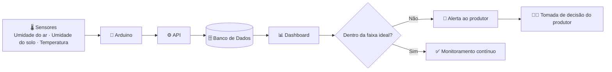

**Monitoramento de Umidade do Substrato, do Ar e de Temperatura em Ambientes de Cultivo de Champignon Paris**

 

## 🍄 Sobre o projeto

O **Agaricus bisporus** (champignon de Paris) é o cogumelo mais cultivado no Brasil, mas é também um dos mais sensíveis: passa por fases distintas de cultivo — compostagem, pasteurização, incubação e frutificação — cada uma com sua própria faixa ideal de temperatura e umidade.

Hoje, o controle manual, baseado na experiência do produtor, torna difícil identificar **qual variável causou uma perda** e **por quanto tempo** a condição ficou fora do ideal. Isso gera perdas recorrentes de **15% a 30% do lote** por doenças, ressecamento ou falha ambiental — um problema especialmente relevante para produtores de **médio e grande porte**, que operam várias câmaras de cultivo ao mesmo tempo.

Este projeto propõe um **sistema de monitoramento** (não de automação) com sensores de umidade do substrato, umidade do ar e temperatura conectados a um Arduino, com coleta periódica dos dados, registro em banco de dados e visualização em um dashboard com alertas — para que o produtor identifique desvios a tempo e tome a decisão.

 

## 🔄 Como funciona

 

## ✨ O que o sistema faz

- 🌡️ **Sensoriamento contínuo** — leitura periódica (a cada 5 min) de umidade do ar, do substrato e de temperatura.
- 🗄️ **Registro histórico** — todas as leituras salvas em banco de dados, por câmara e por lote.
- 📊 **Dashboard** — visualização em tempo real e histórico das condições de cultivo.
- 🔔 **Alertas automáticos** — aviso ao produtor sempre que uma leitura sai da faixa ideal da fase atual.
- 🧑‍🌾 **Apoio à decisão, não automação** — quem decide agir (irrigar, ventilar) continua sendo o produtor.

> [!NOTE]
> O sistema **monitora e alerta**, não soluciona a perda sozinho — a decisão final é sempre do produtor. Automação de ajustes (irrigação/ventilação), app mobile e integração com ERP estão fora do escopo deste protótipo.

 

## 🔗 Links do projeto

| | |
|---|---|
| 📄 Documentação do projeto | [Documento em Docs](https://bandteccom-my.sharepoint.com/:w:/g/personal/enzo_bento_sptech_school/IQAN4ZuB5iQDT5Slp7y-Jzm6AeEP08f_hE3fA4Waf_6eVE8?e=tI92Vh) |
| 🎨 Slide de apresentação | [Canva](https://canva.link/lzc4q4bkl9rcixh) |
| 🗂️ Organização do projeto | [Trello](https://trello.com/b/cUBY6c0U/cog-solutions) |
| 🔧 Montagem do Arduino | [Tinkercad](https://www.tinkercad.com/things/l5auWBOuWrV/editel?returnTo=%2Fdashboard&sharecode=yHCSTdkNJi3PoDbMhmVLzr81HFQQGqiRWNctGYehJwU) |
| 🖼️ Prototipagem do site institucional | [Figma](https://www.figma.com/design/lOQJ3ouqiGeTjRjebh4Cyk/Untitled?node-id=0-1&t=8Z2B4NwLQM1jTaju-1) |
| 📋 Backlog | [Backlog Excel](https://bandteccom-my.sharepoint.com/:x:/g/personal/enzo_bento_sptech_school/IQDjvXNZblUtQaP1piUuVKDFATaHyE8DDdHf_Cz7kLwmhhM?e=BUfgIx) |

 

## 🧪 Tecnologias

 

## 🏆 Contribuidores do projeto (Grupo 5 — Sprint 2)

- Christian Miranda Correia
- Enzo Fuchs Bento
- Mariana de Oliveira Soares
- Paulo Henrique de Souza
- Victor dos Passos Soares de Souza
- Vitor Alexandre Osuna Arevalo

 

